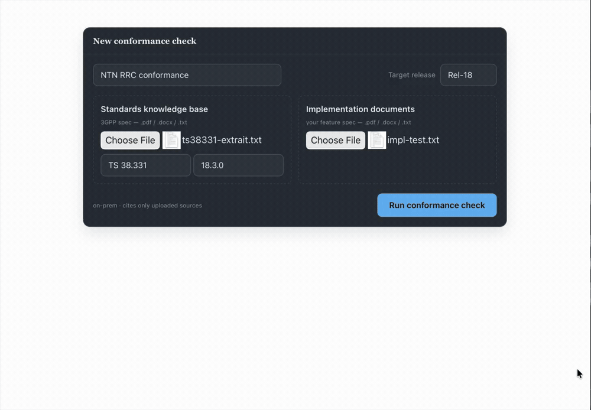

# Spec Conformance Agent (agentic stack)

 

A 3GPP/O-RAN **document-level** conformance engine on a full modern agentic-SaaS
stack. **Every tool has an explicit, working role**, nothing is a placeholder.
The moat modules (`lib/parser-3gpp.ts`, `lib/conformance-contract.ts`) are
stack-agnostic; everything else is built on this stack.

## Problem

Verifying a device implementation against a 3GPP specification is manual and slow:
an engineer cross-reads thousands of clauses to judge whether each requirement is met.
This tool produces that first pass automatically, it ingests the spec plus the
implementation docs and returns an auditable **conformance matrix** where every verdict
cites the exact governing clause.

## Every tool → its role

| Tool | Role in THIS product | Real? |
|---|---|---|
| **Next.js 15** | App framework (UI + API routes) | implemented |
| **Clerk** | Auth + multi-tenancy (Organization = tenant) | implemented |
| **PostgreSQL + Prisma** | Relational store (runs, requirements, assets) | implemented |
| **Qdrant** | Vector store for the vector fallback | implemented |
| **Neo4j** | Clause cross-reference graph (vectorless graph-walk) | implemented |
| **OpenRouter** | LLM gateway (agent calls + embeddings) | implemented |
| **LangGraph** | Bounded pipeline as a state machine | implemented |
| **LangChain** | LLM / embeddings / store plumbing | implemented |
| **Cloudinary** | Raw uploaded-document storage | implemented |
| **Vidimus** | Calibrated confidence + Ed25519-signed attestation (sidecar) | implemented using [kabNath/vidimus](https://github.com/kabNath/vidimus) (bootstrap CI, RFC 8785, Ed25519) |
| **Docker** | Local parity (docker-compose) + on-prem deliverable | Dockerfiles |
| **CI/CD** | GitHub Actions: ci.yml (node + vidimus-svc checks); deploy.yml (manual, workflow_dispatch) | real, OIDC |
| **AWS** | App Runner (app + vidimus) + RDS Postgres, via Terraform | IaC in infra/terraform |

**Retrieval:** vectorless clause-graph navigation over Neo4j as the primary path, with Qdrant vector similarity as a fallback, not naïve chunk-and-embed RAG.

## Architecture

Next.js 15 (UI + API) with Clerk auth (orgId = tenant) drives a LangGraph state
machine: `extract -> ( retrieve -> compile )* -> END` (the deterministic shell).
- retrieve: vectorless graph-walk on Neo4j + Qdrant fallback (bounded)
- assess: verdict + confidence, grounded only in the cited clause
- verify: adversarial check (catches citation hallucination)
- compile: Vidimus attest -> calibrated confidence + signed proof
Persistence: Prisma/PostgreSQL (matrix rows), Cloudinary (blobs), Vidimus (attestations).

## Run locally

    docker compose up -d                 # postgres + qdrant + neo4j + vidimus
    cp .env.example .env.local           # fill Clerk / OpenRouter keys
    npm install
    npx prisma migrate dev --name init
    npm run ingest -- <orgId> ts38331 "TS 38.331" 18.3.0 Rel-18 examples/ts38331-extrait.txt
    npm run dev                          # http://localhost:3000

## Deploy to AWS

The infrastructure is real Terraform plus an OIDC deploy workflow. Deployment
requires AWS credentials: run `terraform apply`, then add the GitHub secrets.

    # 1. Provision AWS (ECR, App Runner x2, RDS, GitHub OIDC role); point at
    #    managed Qdrant Cloud / Neo4j Aura endpoints.
    cd infra/terraform
    cp terraform.tfvars.example terraform.tfvars   # fill in the values
    terraform init && terraform apply
    #    -> outputs: app_url, ecr repos, github_deploy_role_arn, db_address

    # 2. In GitHub repo settings add:
    #    Variables: AWS_REGION
    #    Secrets:   AWS_DEPLOY_ROLE_ARN (=github_deploy_role_arn),
    #               APPRUNNER_APP_ARN, APPRUNNER_VIDIMUS_ARN

    # 3. Run the deploy workflow manually (deploy.yml, workflow_dispatch): it
    #    builds and pushes both images to ECR and starts App Runner. The app is
    #    then live at app_url.

End-to-end deploy: OIDC (no long-lived keys), ECR, App Runner, RDS, no stubs.
`terraform apply` and the GitHub secrets require an AWS account.

## Honest status

- Implemented and defensible line-by-line: the LangGraph pipeline, the vectorless
  Neo4j graph-walk with Qdrant fallback, the adversarial verifier, the 3GPP parser,
  multi-tenant SaaS, the full UI, the Vidimus attestation service, the Terraform IaC,
  and the OIDC deploy workflow.
- Going live requires AWS credentials: `terraform apply` against an AWS account plus
  the GitHub secrets. Until then the system is complete but not on a live URL.
- Current validation: end-to-end on a small TS 38.331 extract; a rigorous evaluation
  (gold set, precision/recall vs. expert-labeled requirements) is the next milestone.
- Polyglot persistence is a deliberate architecture choice: Neo4j is the central
  technical fit (clause-graph navigation), Qdrant is a fallback only, and Postgres
  holds relational run/matrix data.
